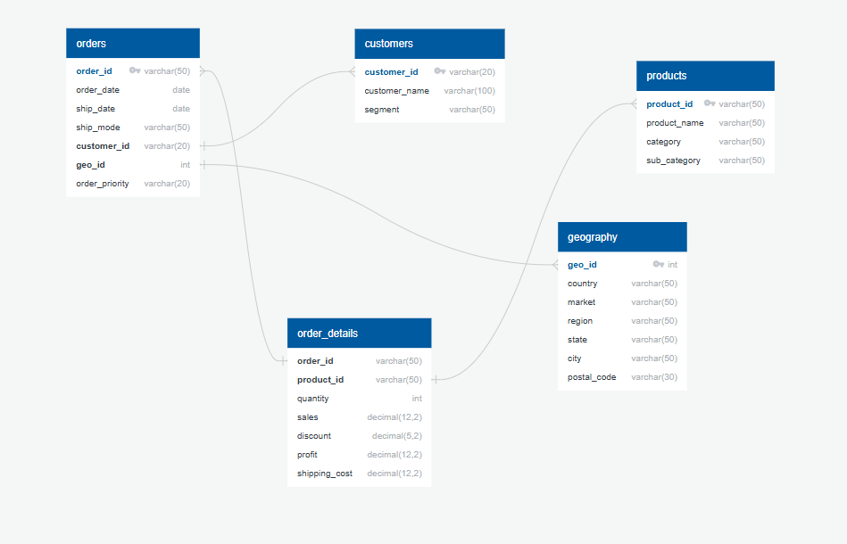

# Global Superstore Sales Data Analysis & Business Intelligence Dashboard

## Project Overview

This project focuses on performing a comprehensive data analysis of the Global Superstore Sales dataset, leveraging a **normalized relational database (PostgreSQL on Google Cloud SQL)** and visualizing key business insights using Google Looker Studio. The goal is to transform raw sales data into actionable intelligence, helping stakeholders understand sales performance, identify trends, optimize product strategies, and enhance customer engagement.

## Problem Statement / Business Goal

In a competitive global retail environment, understanding sales patterns, customer behavior, and product profitability is crucial for strategic decision-making. This project addresses the need for a robust data infrastructure and an intuitive business intelligence dashboard to monitor key performance indicators (KPIs) and uncover opportunities for growth and efficiency.

## Dataset

The analysis is based on the **Global Superstore Sales Dataset**.
* **Source:** [Kaggle - Global Superstore Dataset](https://www.kaggle.com/datasets/fatihilhan/global-superstore-dataset) 
* **Description:** This dataset contains detailed information about sales transactions from a hypothetical global superstore, including customer details, product information, geographical locations, order specifics, and financial metrics (sales, profit, discount, shipping cost) over several years.

## Architecture and Technology Stack

* **Database:** PostgreSQL (hosted on Google Cloud SQL)
    * Used for storing the **normalized** Global Superstore data.
    * Ensures data integrity, reduces redundancy, and optimizes query performance for analytical workloads.
* **Database Design Tool:** QuickDBD
    * Used to design and visualize the relational schema.
* **Business Intelligence (BI) Tool:** Google Looker Studio
    * Utilized for creating interactive and visually appealing dashboards.
    * Connects directly to the Cloud SQL database to fetch and visualize real-time data.

## Database Design & Normalization

To ensure data integrity, reduce redundancy, and optimize the database for analytical queries, the raw Global Superstore dataset was normalized into a relational schema. The design follows principles of normalization (up to 3NF), breaking down the monolithic dataset into smaller, related tables.

The normalized schema consists of the following tables:
* `customers`: Stores unique customer information.
* `geography`: Stores unique geographical locations.
* `products`: Stores unique product details.
* `orders`: Stores order-level information, linking to customers and geography.
* `order_details`: Stores line-item details for each order, linking to products.

This normalized structure facilitates efficient data storage and retrieval, making it ideal for reporting and analysis in BI tools.

**Entity-Relationship (ER) Diagram:**

The following ER diagram illustrates the relationships between the normalized tables:




## Key Business Insights & Visualizations

The Looker Studio dashboard is designed to provide insights across several critical business areas:

1.  **Sales & Profit Performance Over Time:**
    * **Visualizations:** Scorecards (Total Sales, Total Profit), Line Chart (Monthly Sales & Profit Trend), Bar Chart (Annual Sales & Profit Summary).
    * **Insight:** Analyze historical sales and profit trends, identify seasonality, and track overall financial health.

2.  **Top/Bottom Performing Products, Categories, and Sub-Categories:**
    * **Visualizations:** Bar Chart (Top N Products by Sales), Treemap (Sales by Category & Sub-Category), Table (Profit by Category).
    * **Insight:** Pinpoint best-selling and underperforming products/categories, and understand their contribution to overall revenue and profit.

3.  **Geographical Performance:**
    * **Visualizations:** Geo Map (Total Sales by Country), Bar Chart (Sales by Market/Region).
    * **Insight:** Identify high-performing geographical markets and regions, guiding expansion or focused marketing efforts.

4.  **Customer Segmentation Analysis:**
    * **Visualizations:** Donut Chart (Sales by Customer Segment), Table (Top N Customers by Sales/Profit).
    * **Insight:** Understand the purchasing behavior and value of different customer segments (Consumer, Corporate, Home Office).

5.  **Discount Impact Analysis:**
    * **Visualizations:** Bar Chart (Profit Margin by Discount Range), Scatter Plot (Discount vs. Profit by Product).
    * **Insight:** Evaluate the effectiveness of discount strategies on profitability and identify potential areas of loss due to excessive discounting.

6.  **Shipping Mode Efficiency and Cost:**
    * **Visualizations:** Bar Chart (Average Delivery Days by Ship Mode), Table (Total Shipping Cost by Ship Mode).
    * **Insight:** Analyze the efficiency and cost implications of various shipping methods to optimize logistics.

## Live Dashboard

Explore the interactive dashboard directly in Google Looker Studio:

[**View Live Dashboard**](https://lookerstudio.google.com/s/r6Rw2wTpYtQ)


## Project Structure

.
├── README.md
├── sql/
│   ├── 01_schema.sql
│   ├── 02_raw_data_load.sql
│   └── 03_insert_data.sql
├── erd/
│   └── superstore_erd.png
└── looker_studio/
├── dashboard_link.md
└── screenshots/
└── ...


## Setup and Usage

To replicate this project, follow these steps:

### Prerequisites

* A Google Cloud Platform (GCP) account.
* Access to Google Cloud SQL (PostgreSQL instance recommended).
* Access to Google Looker Studio.
* Basic understanding of SQL.

### Database Setup (Cloud SQL - PostgreSQL)

1.  **Clone the Repository:**
    ```bash
    git clone [https://github.com/YOUR_GITHUB_USERNAME/your-repo-name.git](https://github.com/YOUR_GITHUB_USERNAME/your-repo-name.git)
    cd your-repo-name
    ```
2.  **Connect to Your Cloud SQL Instance:**
    Use your preferred method (Cloud Shell, `psql` client, Cloud SQL Proxy, or a GUI tool like DBeaver/pgAdmin) to connect to your PostgreSQL database instance.
3.  **Create Database Schema:**
    Execute the `01_schema.sql` script to create all the necessary tables based on the normalized design:
    ```sql
    -- Example using psql:
    \i sql/01_schema.sql
    ```
4.  **Load Raw Data:**
    Execute the `02_raw_data_load.sql` script to create the staging `raw_data` table.
    **Important:** The raw Global Superstore dataset (CSV file) is typically large. You will need to import this CSV data into the `raw_data` table.
    * **Using Cloud SQL Import:** Go to your Cloud SQL instance in GCP Console, navigate to "Import," select your `raw_data` table, and upload the CSV file from your local machine or Cloud Storage.
    * **Using `psql` COPY command:** If connecting via `psql` from a machine where the CSV is present:
        ```sql
        COPY raw_data FROM '/path/to/your/Global_Superstore_Sales.csv' WITH (FORMAT CSV, HEADER TRUE);
        ```
        *(Ensure the CSV file is accessible from where you run the command and adjust the path)*
5.  **Populate Normalized Tables:**
    Execute the `03_insert_data.sql` script. This script contains the logic to extract, transform, and load data from `raw_data` into your normalized tables, handling duplicates and data type conversions.
    ```sql
    -- Example using psql:
    \i sql/03_insert_data.sql
    ```
    Verify data by running `SELECT COUNT(*) FROM your_table_name;` for each table.

### Looker Studio Dashboard Setup

1.  **Connect Looker Studio to Cloud SQL:**
    * Go to [Looker Studio](https://datastudio.google.com/).
    * Click `+ Create` -> `Data Source`.
    * Select the `PostgreSQL` connector.
    * Enter your Cloud SQL connection details (Hostname, Port, Database, Username, Password).
    * **Add each of your normalized tables** (`customers`, `geography`, `products`, `orders`, `order_details`) as separate data sources. For each, ensure you refresh fields after connecting.
2.  **Recreate the Dashboard (Optional, or Use Live Link):**
    While the live dashboard link provides immediate access, if you want to understand the chart configurations:
    * Create a new report in Looker Studio.
    * For each insight, follow the steps outlined in the `looker_studio_dashboard_guide` (which you have in your previous interactions) to create the charts. Remember to use **Data Blending** to combine data from multiple tables for each visualization.
    * Refer to the screenshots in the `looker_studio/screenshots/` folder for visual guidance.

## Future Enhancements

* Implement row-level security in Looker Studio based on user roles.
* Integrate with other data sources (e.g., marketing data, customer service logs) for a more holistic view.
* Set up automated data refresh schedules for the Cloud SQL database and Looker Studio.
* Explore advanced analytics (e.g., predictive modeling for sales) and integrate results into the dashboard.

## Author

* [Your Name/GitHub Profile Link]

## License

This project is licensed under the MIT License - see the [LICENSE.md](LICENSE.md) file for details.
*(You'll need to create a `LICENSE.md` file in your repository. A simple MIT license is oft
